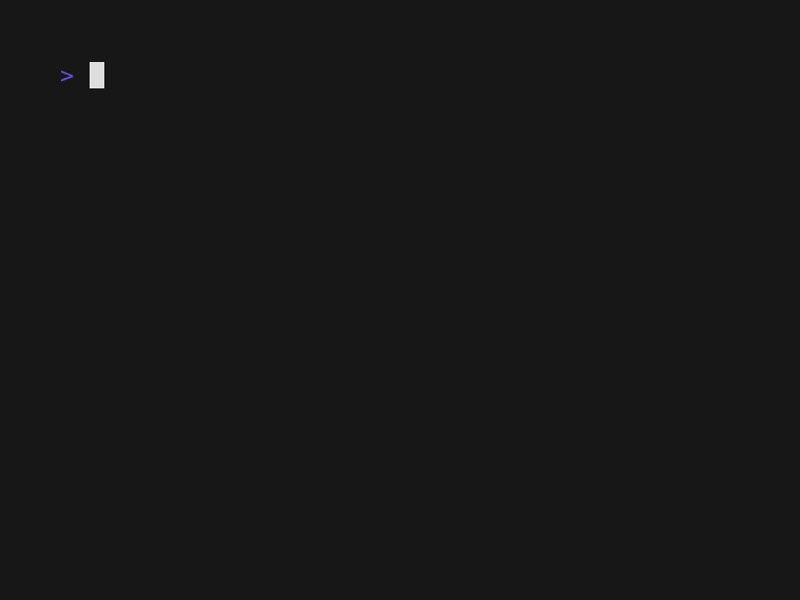

# egor

Egor is a simple Go version manager.

## Installation

[Installation instructions will go here]

## Demos

### Install a Go version

![Install # egor

Egor is a simple Go version manager.

## Installation

[Installation instructions will go here]

## Demos

### Install a Go version

### List installed Go versions

### Switch between Go versions

### Run diagnostics

# egor

Egor is a simple Go version manager.

## Installation

[Installation instructions will go here]

## Demos

### Install a Go version

### List installed Go versions

### Switch between Go versions

### Run diagnostics

### List installed Go versions

### Switch between Go versions

### Run diagnostics

